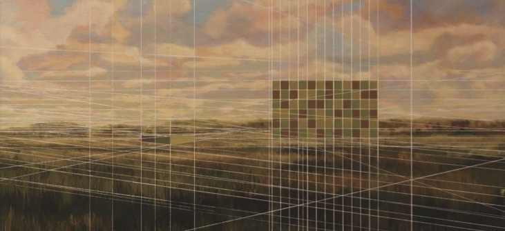
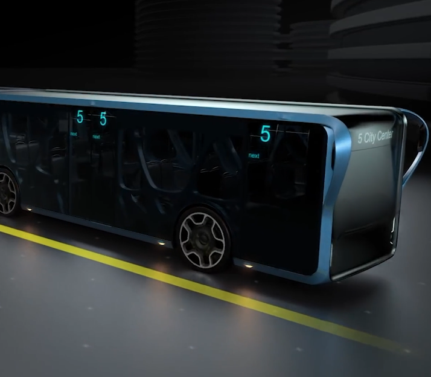
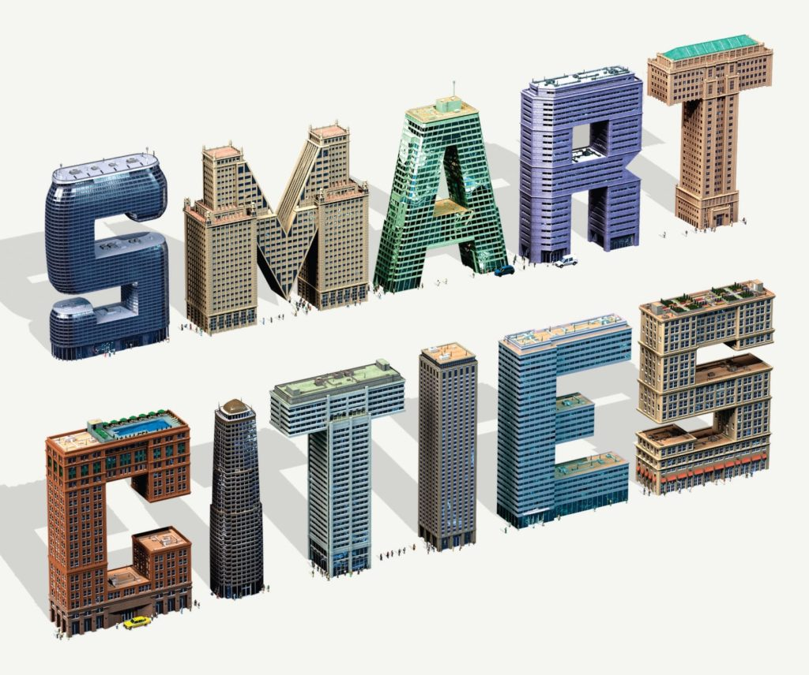

## Books

## Ghost Road: Beyond the Driverless Car

“Ghost Road offers up an exhilarating picture of the ways in which autonomous vehicles might transform our lives for the better, saving time and lines, reshaping cities, and helping combat climate change.” — James Surowiecki, Strategy + Business, “Best Business Books of 2020”

For decades we have tried to build a car that will drive itself. But the driverless car is a red herring. When self-driving technology infects buses, bikes, delivery vans, and even buildings, a wild, woollier, future awaits. Ghost Road explains where we might be headed together in driverless vehicles, and the choices we must make as societies and individuals to shape that future.

**How to Buy.** Patronize independent booksellers worldwide on [Bookshop.org](https://bookshop.org/books/ghost-road-beyond-the-driverless-car-9781684579341/9781324001522). Check  [WORD Bookstores](https://www.wordbookstores.com/book/9781324001522) for local delivery or pickup in Brooklyn and Jersey City. [Amazon](https://www.amazon.com/dp/1324001526/ref=cm_sw_su_dp) has the book in stock and is delivering, and of course has a [Kindle](https://www.amazon.com/Ghost-Road-Beyond-Driverless-Car-ebook/dp/B07ZTSZM5S/) edition for instant download and [Audible](https://www.amazon.com/Ghost-Road-Beyond-Driverless-Car/dp/B08F6T1YR9) audiobook. For bulk book orders, I recommend [Porchlight](https://www.porchlightbooks.com/product/ghost-road-beyond-the-driverless-car--anthony-m-townsend) (up to 250 copies) or [W.W. Norton](https://wwnorton.com/books/9781324001522) (over 250 copies)

**Trailer.** Click to play. (1 min, 47 seconds)

## Smart Cities: Big Data, Civic Hackers, and the Quest For A New Utopia

"\[A\] timely and necessary guide to this age of the Franken-city." — Daniel Brook, The New York Times Book Review

From Beijing to Boston, cities are deploying smart technology—sensors embedded in streets and subways, Wi-Fi broadcast airports and green spaces—to address the basic challenges faced by massive, interconnected metropolitan centers. _Smart Cities_ documents this emerging futuristic landscape while considering the motivations, aspirations, and shortcomings of the key actors—entrepreneurs, mayors, philanthropists, and software developers—at work in shaping the new urban frontier.

**How to Buy.** Patronize independent booksellers worldwide on [Bookshop.org](https://bookshop.org/books/smart-cities-big-data-civic-hackers-and-the-quest-for-a-new-utopia/9780393349788). Check  [WORD Bookstores](https://www.wordbookstores.com/book/9780393349788) for local delivery or pickup in Brooklyn and Jersey City. [Amazon](https://www.amazon.com/dp/0393349780/ref=cm_sw_su_dp) has the book in stock and is delivering.

**Translations and Rights.** Contact your local publisher for more information. Rights inquires, please contact the [Zoë Pagnamenta](http://www.zpagency.com) [Agency](http://www.zpagency.com/about/the-agency/).

| العربية الفصحى | Arab Scientific Publishers | buy |
| --- | --- | --- |
| 臺語 | CITIC Press | [buy](https://www.amazon.com/%E6%99%BA%E6%85%A7%E5%9F%8E%E5%B8%82-%E5%A4%A7%E6%95%B0%E6%8D%AE%E3%80%81%E4%BA%92%E8%81%94%E7%BD%91%E6%97%B6%E4%BB%A3%E7%9A%84%E5%9F%8E%E5%B8%82%E6%9C%AA%E6%9D%A5-%E7%BE%8E-%E5%AE%89%E4%B8%9C%E5%B0%BC%C2%B7%E6%B1%A4%E6%A3%AE/dp/B01EP932Q0) |
| eesti keeles | ARIPAEV | buy |
| 한국어 | MID | [buy](http://www.yes24.com/Product/Goods/61308682) |
| 普通话 | Faces Publishing | [buy](https://goods.ruten.com.tw/item/show?21829358189062) |
| Русский | [Gaidar Institute](https://inde.io/article/17180-polnye-bagov-goroda-mogut-ukrepit-demokratiyu-otryvok-iz-knigi-urbanista-entoni-taunsenda-umnye-goroda) | [buy](https://market.yandex.ru/product--taunsend-e-umnye-goroda-bolshie-dannye-grazhdanskie-khakery-i-poiski-novoi-utopii/561036115/spec) |
