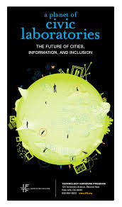

In 2010, the explosive growth of cities promised an economic opportunity with the potential to lift billions out of poverty. Yet the speed of change and lack of pro—poor foresight had already led to a swarm of urban problems—poor housing conditions, inadequate education and health care, and racial and ethnic inequalities.

Then "big data" arrived on the scene, with the tantalizing potential to improve government services, alleviate poverty and inequality, and empower the poor. Excitement and skepticism abounded.

This ten-year forecast map, developed with the Institute for the Future for The Rockefeller Foundation, provided a graphical exploration of technology drivers and trends shaping the future of cities, information, and inclusion. It became a foundational document for policy makers, philanthropists, and activists around the world and helped spur many subsequent forecasting efforts by others.

View presentations of the map from April 2011 at [MIT’s Forum on Future Cities](https://www.slideshare.net/anthonymobile/a-planet-of-civic-laboratories) and at the [Museum of Vancouver](https://www.slideshare.net/anthonymobile/a-planet-of-civic-laboratories-museum-of-vancouver).

Download the map from Institute for the Future. ([PDF](https://www.iftf.org/uploads/media/IFTF_Rockefeller_CivicLaboratoriesMap_01.pdf)) ([Prezi](https://prezi.com/4ylwohu2cztp/a-planet-of-civic-laboratories/))
