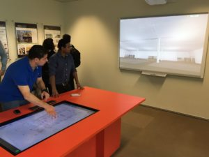
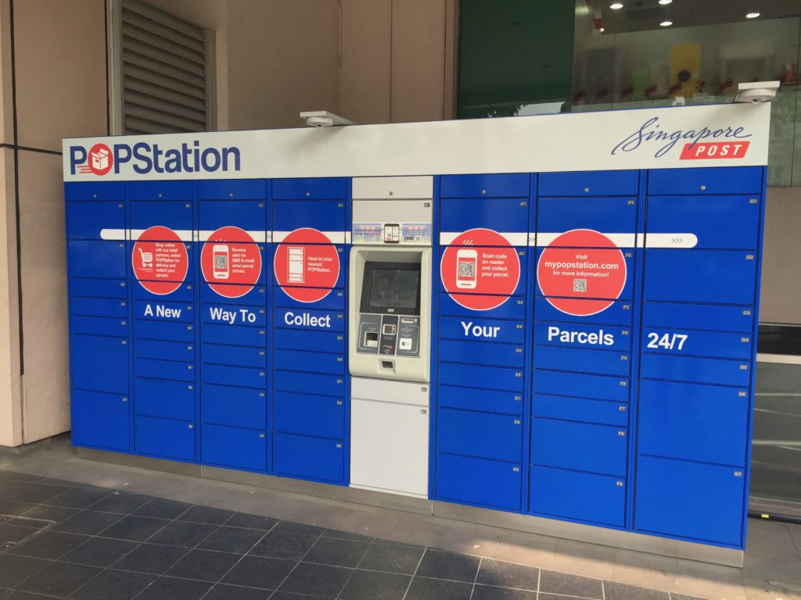
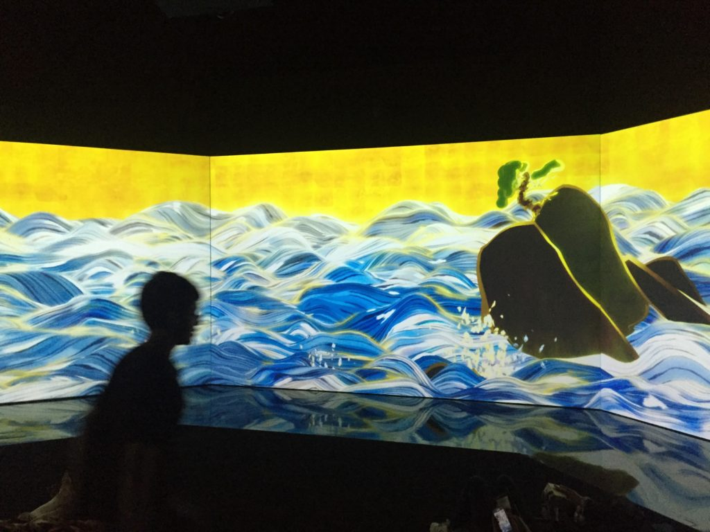
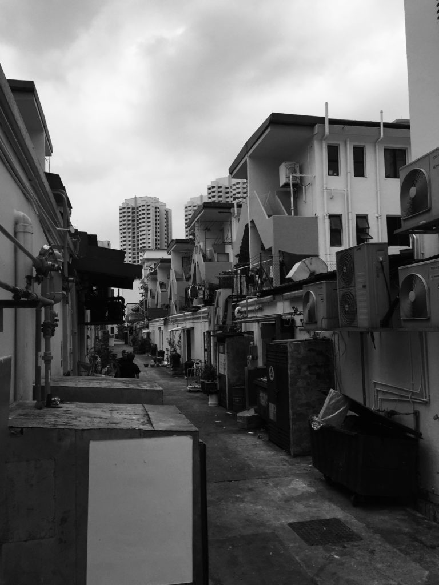

Seeing is believing. This is as true in executive education as it is for kindergartners. In 2016, we worked with global architecture, engineering, and planning consultancy Arup on the final sequence of a three-year capstone course on smart cities.

<figure>

<figcaption>

Demonstration at the Construction Productivity Gallery, Building Construction Authority

</figcaption>

</figure>

This week-long mix of classroom lectures and site visits brought young leaders face-to-face with thinkers and doers in industry, academia and government in one of the world's foremost smart cities.

The takeaway? A broader understanding of future trends and technologies, their impacts and applications, and new strategies for applying them in day-to-day business situations.

* * *

<figure>

<figcaption>

Singapore Post is a leader in delivery innovation as the nation-state seeks to reduce traffic congestion and get ready for a massive restructuring of retail, with up to 65 percent of shopping expected to go by courier by 2050.

</figcaption>

</figure>

<figure>

<figcaption>

At Singapore's ArtScience Museum, works blending data and sensing are offering new perspectives on critical social, cultural and artistic concerns, such as sea level rise.

</figcaption>

</figure>

<figure>

<figcaption>

Some of Singapore's oldest urban technology—air conditioning retrofits to the Tiong Bahru garden city district, the nation's first public housing project.

</figcaption>

</figure>
