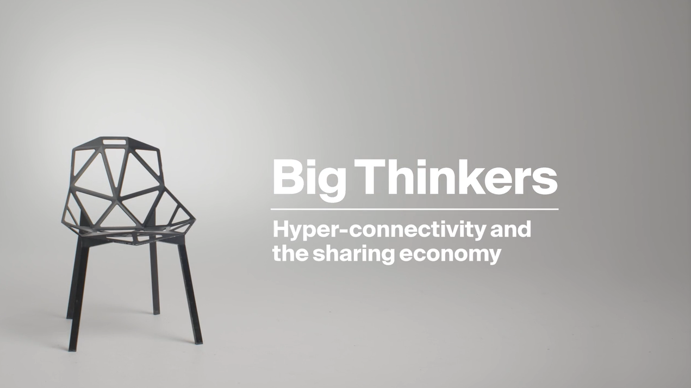

In this interview, produced by Esquire UK for the launch of the Hyundai IONIQ Electric, we explore how urban sharing has shaped cities and how technology will create new opportunities in the near future.

