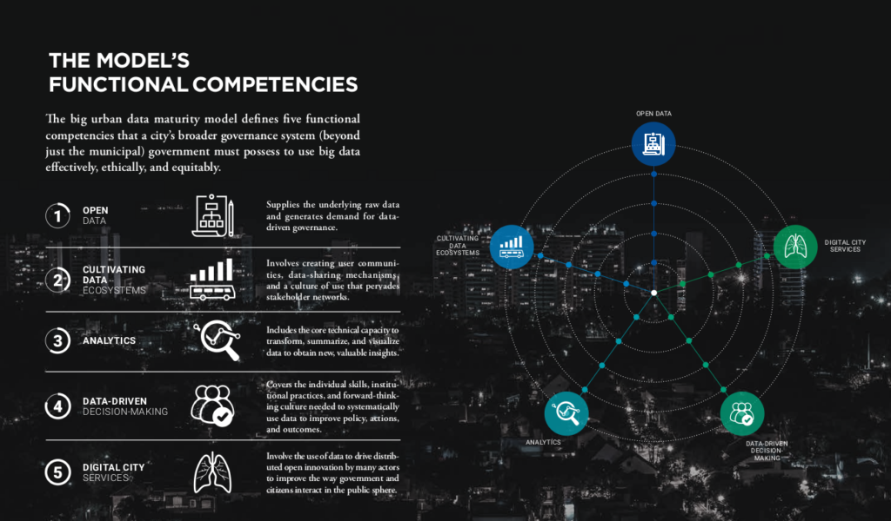

City governments have a lot of places to turn to for ideas and blueprints about focused ways to use big data and analytics to drive innovation. But there's nothing to help them think strategically about big data and make coordinated investments and reforms that pay off over time.

To fill this gap, we worked with the Inter-American Development Bank to develop a _big data maturity model_. While this model was created for cities in the Latin America and Caribbean region, it can be a valuable tool for cities everywhere.

The model defines five levels of maturity, across six functional areas of big data capability

- sharing **open data**,

- cultivating an **ecosystem of external data suppliers and users**,

- **analyzing** data to create new insights,

- using those insights effectively in **decision-making**, and

- enabling improvement in **citizen services**.

* * *

Los gobiernos de las ciudades tienen muchos lugares a los que recurrir para obtener ideas y planos sobre formas específicas de utilizar big data y análisis para impulsar la innovación. Pero no hay nada que los ayude a pensar estratégicamente sobre big data y realizar inversiones y reformas coordinadas que valgan la pena con el tiempo.

Para llenar este vacío, trabajamos con el Banco Interamericano de Desarrollo para desarrollar un modelo de madurez de big data. Mientras este modelo fue creado para ciudades de la región de América Latina y el Caribe, puede ser una herramienta valiosa para ciudades de todo el mundo.

El modelo define cinco niveles de madurez, en seis áreas funcionales de capacidad de big data:

- compartir **datos abiertos**,

- cultivando un **ecosistema de proveedores y usuarios de datos externos**,

- **analizar datos** para crear nuevas ideas,

- utilizando esos conocimientos de manera **efectiva en la toma de decisiones**, y

- permitiendo la mejora en **los servicios al ciudadano**.

(Download PDF [eng](https://perma.cc/2DWP-Z7TE) / Descargue PDF esp)
