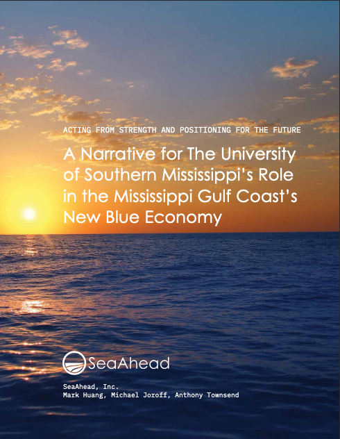

The oceans are at once an e xploited and under-developed resource, a mysterious territory put to use with the most primitive of technologies. As part of our growing partnership with Boston-based bluetech startup platform SeaAhead, we worked with the University of Southern Mississippi and the City of Gulfport to develop a strategic narrative for a regional applied science and technology cluster on the state's Gulf Coast. Our work identified three key elements of this narrative:

- supporting new ventures based on novel R&D in focused areas of cross-sector convergence;

- encouraging the outsourcing of technical services for the growing global blue economy into the region; and,

- developing the region as a world-class test bed for blue economy technologies, with test ranges encompassing a full set of maritime, littoral, and aerospace settings.

Download the report [here](https://www.starcitygroup.us/wp-content/uploads/2020/08/SA-Gulfport-BEID-20200124.pdf).

