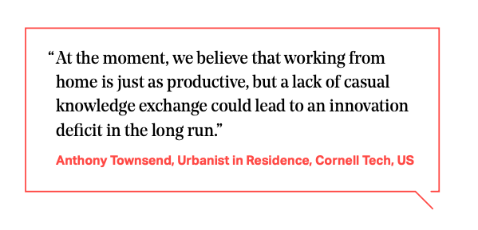

We were delighted to participate in a fascinating new study by longtime collaborators Lean Doody and the team at Arup on "workplacemaking", a new approach to designing and managing distributed work in the post-pandemic city. See the report, [_Making Place: The recalibration of Work, Life and Place_](https://www.arup.com/perspectives/publications/promotional-materials/section/making-place-the-recalibration-of-work-life-and-place) at Arup.com.

