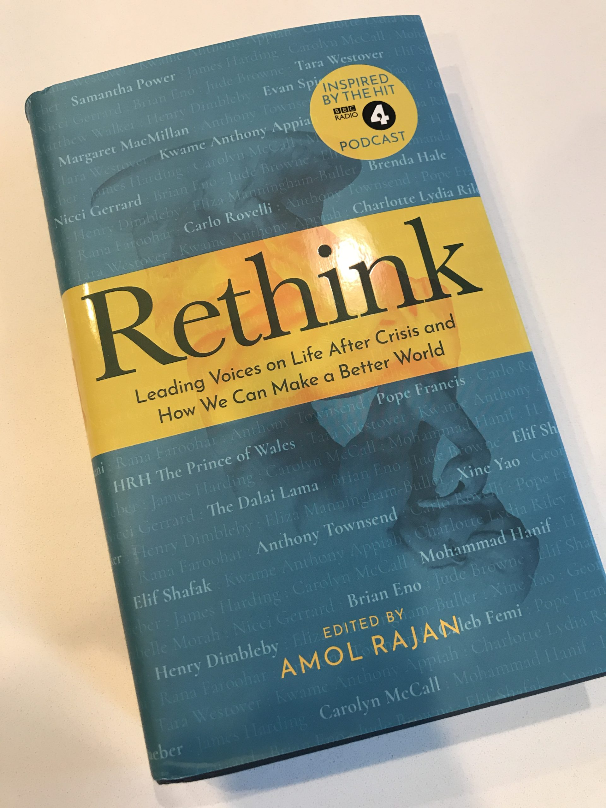

_GHOST ROAD_ was published in June 2020 as the first wave of the COVID-19 pandemic was winding down and Black Lives Matter protests were winding up. While we struggled to find a space to talk about the future of autonomous vehicles amidst so many urgent and important conversations—one opportunity did arrive on our doorstep in early July, the BBC's remarkable _Rethink_ podcast.

I recorded a short essay which you can [play here](https://www.bbc.co.uk/programmes/p08jhb6k), which asked what the remarkable mobilization of automated logistics during the lockdowns of spring 2020 might mean for the future of our cities.

That podcast became a book, and you can now purchase a copy of _[Rethink: Leading Voices on Life After Crisis and How We Can Make A Better World](https://www.penguin.co.uk/books/144/1443317/rethink/9781785947179.html)_ from Penguin UK. I'm honored to be featured alongside the Dalai Lama, Pope Francis, Brian Eno, and so many other brilliant thinkers.

