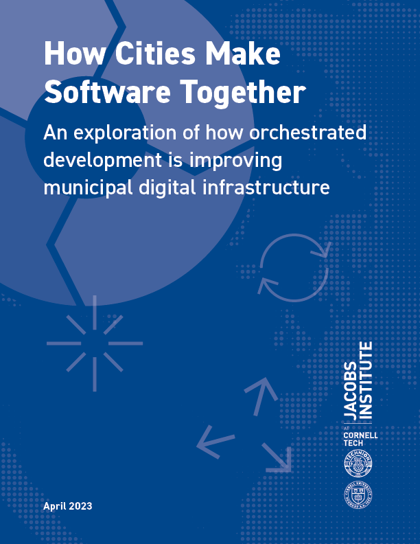

Municipal governments are riding a volatile wave of economic, ecological, and social change. But one thing is constant—the accelerating spread of digital technologies. More specifically, municipal governments are learning how to use software to measure, analyze, and optimize service delivery. But even as cities rely more on software to function, they struggle to obtain and maintain software. Traditionally, code is procured from the private sector, or—less often—produced in-house by cities. But both of these approaches are slow, costly, and often fail to deliver innovation. Software vendors often fill in these gaps, locking in costly dependencies on inflexible products.

Open Source Software (OSS) presents a possibility for cities to fulfill their software needs. It also offers the potential for greater autonomy and lower cost. However,OSS requires enormous effort to create, and even more to deploy and maintain. These processes are just as important as the final product. The growing base of code and processes are the basis of a specialized class of digital infrastructure, known as **_municipal digital infrastructure_**.

[Download](https://sites.coecis.cornell.edu/urbantech/files/2023/04/How-Cities-Make-Software-Together.pdf) the report from the Jacobs Urban Tech Hub.

