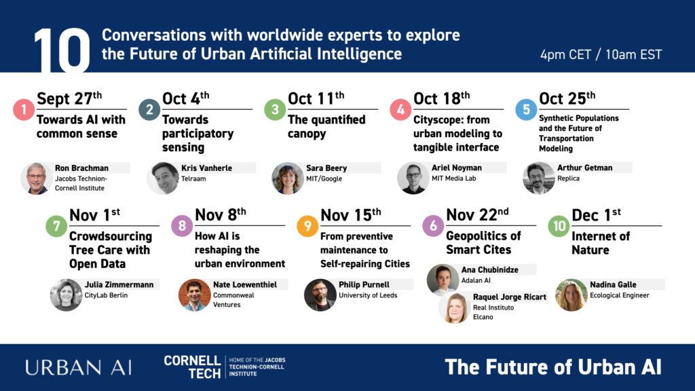

Following the publication of [The Future of Urban Tech: A Ten-Year Horizon Scan](https://futureofurbantech.org), we began a collaboration with Paris-based think tank Urban AI that is now entering its second year. Over a series of 10 scheduled webinars, we brought together urbanists and technologists from around the world to examine how AI is being used and misused to shape future cities. _(Note: The banner image above was created with DALL-E 2 using the following prompt: "A futuristic city of medium-rise buildings with bio-inspired architecture, photorealistic.")_

You can [watch all of the talks on YouTube](https://www.youtube.com/playlist?list=PLHbnOHU3auCcy1vmzsVYWKJ1BF0Rfn7FO), [download a notebook](https://sites.coecis.cornell.edu/urbantech/files/2023/05/Future-of-Urban-AI-Summary.pdf) summarizing the series, and [read my perspective essay](#essay) below.

* * *

#### **Urban AI Exits** **the “Trough of** **Disillusionment”**

Future historians will look back on 2022 as the year deep learning broke out of the box. It had only been a decade since the technology burst onto the scene, when the AlexNet convolutional neural network smashed records in the 2012 ImageNet Large Scale Visual Recognition Challenge (ILSVRC), computer vision’s Grand Prix. But despite a rapid spread into every domain of science and industry, deep learning remained behind the scenes, buried deep in the cloud or stashed under the hood of self-driving cars.

The twin bombshells of DALL-E 2 and ChatGPT, released by San Francisco-based startup OpenAI in November, changed all that. Suddenly deep learning was right in our faces. Anyone with a smartphone could order up synthetically generated images and prose, tapping a simulated intelligence with the vast archives of the web at its disposal. With delight, we started to play with these new handheld deepfake factories. But the deep meaning of deep learning could no longer be ignored. It wasn’t simply for targeting ads or driving machines down interstate highways. It was for making the culture, in a turbocharged burst of creativity powered by our own natural language.

It didn’t take long for urban technologists to see the possibilities. At Cornell Tech, we’re exploring how to use DALL-E to empower community groups to produce photorealistic illustrations of proposed developments, to support campaigns for better design. One of our master’s students is building a DALL-E-esque tool for generating 3-D models of buildings and even entire districts from natural language requests. “Hey Siri! Draw me a dense block of low-rise multi-family dwellings with common gardens and bike parking.” Urban designers of the future will simply dictate straight to a digital twin, it seems.

But the excitement over large language models, the AI approach behind DALL-E and ChatGPT, glosses over lingering barriers to deep learning’s usefulness in the urban realm.

The first obstacle is deep learning’s voracious appetite for data. The power of convolutional networks, the underlying algorithm behind most deep learning today, comes from their ability to identify intricate patterns in the gargantuan corpus of texts and images available on the public web. But urban AI operates in relative data scarcity. And this isn’t just a lack of instrumentation. Deploying more sensors won’t close the gap. Even the most abundant urban data on hand today, like mobile phone “bread crumb” trails don’t come close in magnitude or dimensionality to the training data ChatGPT wields to crack a joke or write a piece of code.

There are also institutional obstacles to amassing sufficient training data for deep urban AI. Data generated in urban settings is often closely held. Businesses guard trails scraped from apps to extract commercial value. Branches of city government secure data streams under increasingly strict administrative guidelines, and routinely keep them from each other. Such “silos” of secret data are the norm, and the barriers between them are growing stronger rather than weaker, and justifiably so, as our concerns about data privacy and security swell.

This data scarcity may make city streets a safer place than the open web when it comes to tracking individual activity, but it hamstrings urban analysts. This is a longstanding challenge. Data scarcity has afflicted urban modeling efforts from the very beginning, and was one of the “seven sins of large scale models” identified by the scholar Douglass Lee in a seminal 1973 paper.1 Deep learning’s payoff for urban AI may be much further in the future than we think, if it ever arrives at all.

The second obstacle to deep learning in the urban world has to do with the narrow nature of its perception and prediction, and why they are so data-hungry to begin with. As AI scholars Gary Marcus and Ernest Davis put it, most deep learning systems behave like “idiot savants”. They exhibit superhuman ability within a limited domain of recognition tasks, but fail suddenly when confronted with novel examples not present in the training data. This brittle form of recognition is an outgrowth of how deep learning actually “learns”. Deep learning tools don’t actually understand what it is you are asking, the texts they are scanning, or their own responses in any formal

logical sense. They are mostly just superhuman summarizers, able to predict with uncanny speed and precision the next word or pixel that fits best, based on everything that has ever been written or drawn or photographed before.

This has big implications on the streets of New York, Shanghai, or Istanbul. Cities like these constantly surprise us with new situations, combinations, and events. It isn’t a flaw. It is a feature. Deep learning’s extreme specialization requires great care in engineering and design to fit into such complex settings. But more troublesome is deep learning’s brittleness when dealing with “edge cases”, as computer scientists call them. It also turns out to be rather difficult to predict when a deep learning system will fail at its assigned task, making it far more risky to deploy them in high stakes use cases in complicated cities. Step outside the record of the past on which a deep learning model is trained, and you step off the map. Coupled with the “black box” inscrutability of deep neural nets (a property scholars call “interpretability”) that makes it hard to explain why a model produces the predictions it does, what makes deep learning so dangerous in these sorts of settings is its propensity to fail catastrophically but without revealing much about how to avoid such mistakes in the future.

Deep learning’s difficulties in adapting to city life are formidable obstacles. These missteps will likely slow the pace of adoption, yet also drive new innovations that carry the whole field forward. This is clearly the case in applications such as automated driving, which has both failed to deliver on its original timetable, yet spurred massive investments and breakthroughs that will have far-reaching impacts. The quest for self-driving vehicles, as quixotic as it seems at times, is really our generation’s “space race”—a massive technological push with big, unforeseeable impacts. But it is also an opportunity to reconsider other, older ideas about how to create artificial intelligence. Solving the most mundane everyday problems city dwellers face requires drawing on enormous and contextual bodies of knowledge that deep learning algorithms rarely tap—what we think of as “common sense”. Classical AI, with its reliance on symbolic reasoning and structured representations of knowledge, can tap the vast network of ontologies being developed around smart cities, buildings, and infrastructure to fill the holistic gaps in deep learning’s worldview. Understanding our cities presents perhaps the greatest challenge to true AI. But the tools are falling into place, and with luck we will soon enough assemble and harness these capabilities to the great benefit of all humanity.

It is, however, still early days. Today, the starting point for an exploration of the future of urban AI begins in what technology forecasters call “the trough of disillusionment”, the period after initial hype for a new technology has worn off, and the hard work of putting it to ethical, productive use begins. After a decade of hype about self-driving cars and the growing literature on implicit bias embedded within production AI in the public sector, we are wary. But now we have a much clearer idea about which tools we might develop or use, and where to apply them.
