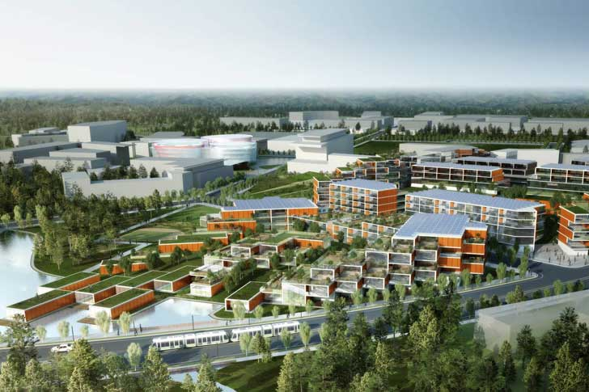

When North Carolina set out in 1959 to build the Research Triangle Park, the state was ranked 49th in per capita income. Furniture was the state’s biggest export. A massive brain drain was underway. But the vision of a high-tech hub, nurtured over many decades by a broad coalition of the willing, created the success we see today.

In 2008, as RTP neared its 50th anniversary, we worked with the Institute for the Future to develop a long-range forecast of technology-based economic development to chart the next 50 years for the park’s manager, the Research Triangle Foundation. We spent three years immersed in the international science and technology parks community, working with leaders to map assets, gaps and strategies for future-proofing tech-based economic development strategies.

The results—14 trends and 3 scenarios—highlight the challenges and opportunities facing science and technology parks and incubators established in earlier eras. They show how deep shifts in the global economy, science and technology, and models of innovation will require new strategies.

At RTP, these scenarios pointed to a common response to maximize the appeal and flexibility of a 21st century innovation hub—adding housing, improving connectivity, and rolling out amenities. In short, urbanizing the technology park. With our help, RTP began to undertake a new master plan that is helping it restructure to meet the demands of today’s most innovative companies and talent.

Download the report [here](/pdf/1B-SR-1236-Future-Knowledge-Ecosystems.pdf). Print-on-demand hard copies are available on [Amazon](https://www.amazon.com/Future-Knowledge-Ecosystems-Anthony-Townsend/dp/B009AKLB86).
