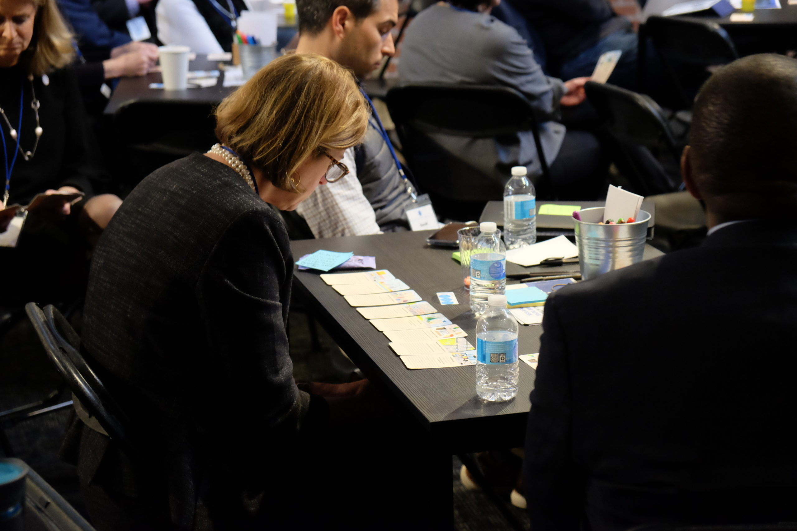
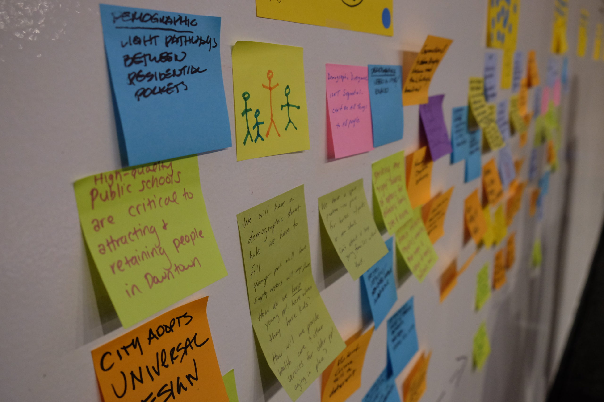

_Update: Check out St. Louis Magazine's [in-depth coverage](https://www.stlmag.com/longform/how-can-st-louis-build-on-its-recent-momentum/) of the Design Downtown STL project. "[Smart Cities](https://www.amazon.com/Smart-Cities-Civic-Hackers-Utopia/dp/0393082873) author Anthony Townsend, an expert on urbanization and digital technology, says St. Louis should develop a long-term stand-alone digital master plan, just as it developed a sustainability plan. He says automated vehicles are just on the horizon and “will challenge everything we think we know about how to design cities.”_

* * *

By most definitions of the "Rust Belt", St. Louis is a far-flung satellite, if it is included at all. But among big U.S. cities, no other felt the impacts of de-industrialization so fiercely. In the 1970s alone, the population of St. Louis declined by 28 percent—faster than Detroit, Cleveland, or Buffalo.

Today, St. Louis is bouncing back and its downtown is at the forefront. Tech companies like Square are relocating to St. Louis, taking advantage of a deep talent pool, superb transportation infrastructure, and a world-class but still under-the-radar restaurant scene. In 2019, Downtown STL, the area's special improvement district, hired Philadelphia-based Interface Studio to lead a year-long planning process. Design Downtown STL seeks to engage a broad range of voices to define a vision that can drive downtown's success forward to 2030.

Working under Interface Studio, Star City Group created a ten-year forecast of the future of downtowns to spur thinking about how global urban trends might shape opportunities and challenges for downtown St. Louis. The forecast was delivered as a set of illustrated tarot-format cards presenting eight trends.

During a workshop in St. Louis in January 2020, a group of more than 40 public and private stakeholders used the cards as a foil for a shared exploration of the context for the coming decade. Insights provoked by the forecasts were recorded on a shared workspace.

You can download a PDF of the [full card set](/wp-content/uploads/2020/02/St-Louis-Workshop-Cards.pdf).

<figure>

<figcaption>

Tarot-sized cards provide an engaging way to communicate trends and facilitate discussion. Cards support both individual brainstorming and small group discussion.

</figcaption>

</figure>

