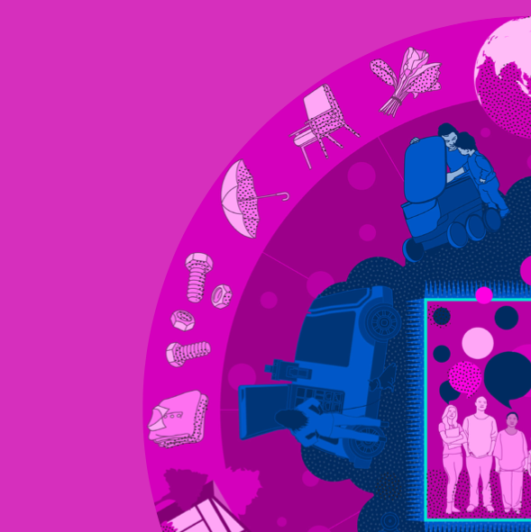

In the spring of 2020, we began working with Julia Powles, Bianca Wylie, and the team at Minderoo Foundation as part of a larger effort to reset the global conversation about technology platforms and power. Almost as soon as we started, the COVID-19 pandemic struck and reset our own thinking. What began as an exploration of ride-hail cooperatives expanded into a much larger visioning of the future of the technology-mediated material economy in local communities.

Working with Bryan Boyer at Dash Marshall, we developed a set of three scenarios that explore in turn how consumer cooperatives, maker collectives, and national postal systems can play a crucial role in rewriting the future of last mile delivery systems as a tool for wealth development rather than wealth extraction.

Download the illustrated report. ([PDF](/pdf/The-Most-Important-Mile.pdf), 5.6 Mb)

